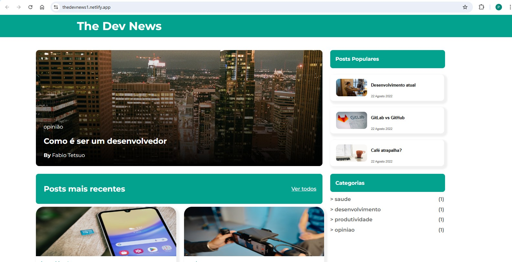
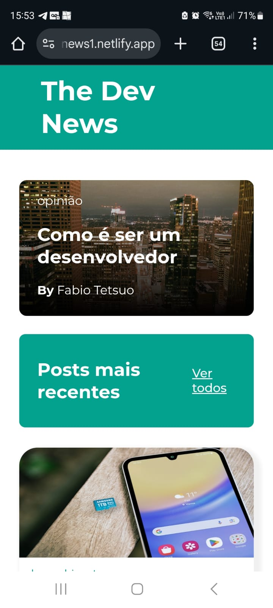

# 📰 The Dev News

Um layout responsivo para um blog ou portal de notícias focado em tecnologia e desenvolvimento, criado como parte de [Mencione o curso, desafio ou motivo aqui, por exemplo: "um projeto de estudo de HTML e CSS"].

### 🔗 [Link para o Deploy (clique aqui)](https://thedevnews1.netlify.app/)

## 🎨 Layout (Demonstração)

[COMO USAR: Tire screenshots do seu projeto e adicione aqui. Você pode arrastá-las para o GitHub ou usar um link.]

|                        Versão Desktop                         |                        Versão Mobile                         |
| :-----------------------------------------------------------: | :----------------------------------------------------------: |
|  |  |

## 📖 Sobre o Projeto

**The Dev News** é uma interface de blog moderna e limpa. O objetivo principal deste projeto foi praticar e aplicar conceitos avançados de HTML semântico e CSS, focando em [Mencione seus principais desafios, ex: "responsividade com CSS Grid", "estrutura semântica", "Flexbox", etc.].

## 🚀 Funcionalidades

O layout do projeto inclui as seguintes seções:

- **Header:** Cabeçalho principal com o título do blog.
- **Post em Destaque:** Uma seção principal para o artigo mais importante.
- **Posts Populares:** Uma seção com cards horizontais para posts populares.
- **Posts Recentes:** Um grid com os artigos mais recentes do blog.
- **Categorias:** Uma seção lateral (sidebar) para listar as categorias dos posts.
- **Footer:** Rodapé com informações de copyright.

## 🛠️ Tecnologias Utilizadas

Este projeto foi construído utilizando as seguintes tecnologias:

- **HTML5:** Para a estrutura e semântica do conteúdo.
- **CSS3:** Para estilização, layout (Flexbox/Grid) e responsividade.
- **Google Fonts:** Para a fonte "Montserrat".

## 📚 O que aprendi

- Estruturação de um layout complexo de forma semântica (uso correto de `<header>`, `<main>`, `<section>`, `<article>`).
- Implementação de responsividade usando [CSS Grid, Flexbox, Media Queries - descreva o que usou].
- Melhoria da hierarquia de títulos (uso correto de `<h1>` a `<h6>`) para acessibilidade e SEO.

## 🏃 Como Executar

Este é um projeto estático (apenas HTML e CSS). Para executá-lo localmente:

1.  Clone este repositório:
    ```bash
    git clone [link_do_seu_repositorio_git]
    ```
2.  Entre na pasta do projeto:
    ```bash
    cd [nome_da_pasta_do_projeto]
    ```
3.  Abra o arquivo `index.html` no seu navegador.

## 👨‍💻 Autor

Feito por **[Seu Nome Aqui]**.

[](https://www.linkedin.com/in/natanael-pantoja-a998862b2/)
[](https://github.com/NatanPantoja)
